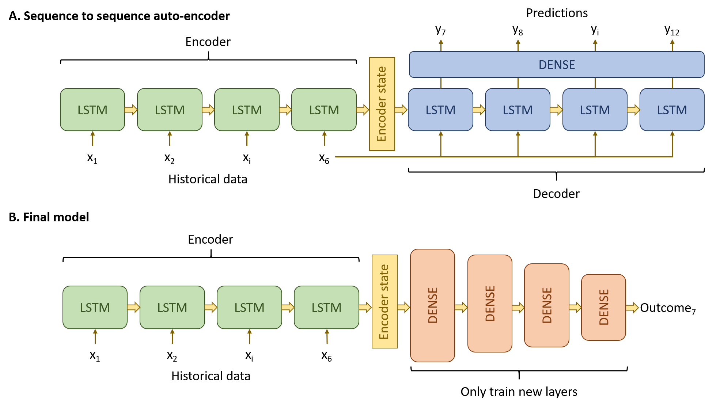

## A deep recurrent neural network to predict ward deterioration

This site contains the model and sample data related to the paper:

Parth K. Shah^1^; Jennifer C. Ginestra^2^; Lyle H. Ungar^3^; Paul Junker^4^; Jeff I. Rohrbach^4^; Neil Fishman^5^; Gary E. Weissman^2,5^. *A Simulated Prospective Evaluation of a Deep Learning Model for Real-Time Prediction of Clinical Deterioration Among Ward Patients* 

^1^Perelman School of Medicine, University of Pennsylvania
^2^Palliative and Advanced Illness Research Center, Perelman School of Medicine, University of Pennsylvania
^3^Computer and Information Science Department, University of Pennsylvania
^4^Clinical Effectiveness and Quality Improvement, Hospital of the University of Pennsylvania
^5^Department of Medicine, Hospital of the University of Pennsylvania

## Background

## Software requirements

## Model inputs

The model accepts as input an array if dimension $n$ (batch size) by 6 (one-hour time steps x 6 hours) by 61 (features). The order of the input variables in the input vector matters and is as follows:

|Variable                         |
|:--------------------------------|
|TIME_DAY                         |
|WEEK_DAY                         |
|AGE                              |
|GENDER                           |
|RACE_BLACK                       |
|RACE_ASIAN                       |
|RACE_OTHER                       |
|RACE_UNKNOWN                     |
|ICU_DISCHARGE                    |
|SURGERY                          |
|OBGYN                            |
|LACTATE_RESULT                   |
|HEART_RATE                       |
|SYSTOLIC_BP                      |
|TEMPERATURE                      |
|RESPIRATORY_RATE                 |
|SOFA_RESP_SUPPORT_FLAG           |
|SOFA_RESP_SPO2                   |
|SOFA_PLATELET_RESULT             |
|SOFA_CREATININE_RESULT           |
|SOFA_BILIRUBIN_RESULT            |
|SOFA_CVS_MAP_RESULT              |
|SOFA_CNS_GLASGOW_RESULT          |
|SOFA_URINE_OUTPUT_24HR           |
|BLOOD_CULTURE_DRAWN_FLAG         |
|TEMPERATURE_24HR_MAX             |
|TEMPERATURE_24HR_MIN             |
|SYSTOLIC_BP_24HR_MAX             |
|SYSTOLIC_BP_24HR_MIN             |
|HEART_RATE_24HR_MAX              |
|HEART_RATE_24HR_MIN              |
|RESPIRATORY_RATE_24HR_MAX        |
|RESPIRATORY_RATE_24HR_MIN        |
|SOFA_RESP_SPO2_24HR_MIN          |
|SOFA_PLATELET_RESULT_24HR_MIN    |
|SOFA_BILIRUBIN_RESULT_24HR_MAX   |
|SOFA_CVS_MAP_RESULT_24HR_MIN     |
|SOFA_CNS_GLASGOW_RESULT_24HR_MIN |
|SOFA_CREATININE_RESULT_24HR_MAX  |
|LACTATE_RESULT_28HR              |
|TEMPERATURE_72HR_MAX             |
|TEMPERATURE_72HR_MIN             |
|SYSTOLIC_BP_72HR_MAX             |
|SYSTOLIC_BP_72HR_MIN             |
|HEART_RATE_72HR_MAX              |
|HEART_RATE_72HR_MIN              |
|RESPIRATORY_RATE_72HR_MAX        |
|RESPIRATORY_RATE_72HR_MIN        |
|SOFA_RESP_SPO2_72HR_MIN          |
|SOFA_PLATELET_RESULT_72HR_MIN    |
|SOFA_BILIRUBIN_RESULT_72HR_MAX   |
|SOFA_CVS_MAP_RESULT_72HR_MIN     |
|SOFA_CNS_GLASGOW_RESULT_72HR_MIN |
|SOFA_CREATININE_RESULT_72HR_MAX  |
|LACTATE_RESULT_FREQ              |
|TEMPERATURE_FREQ                 |
|RESPIRATORY_RATE_FREQ            |
|SYSTOLIC_BP_FREQ                 |
|HEART_RATE_FREQ                  |
|GRAM_POS                         |
|GRAM_NEG                         |

## Usage

## Outputs

The model outputs a vector of length $n$ containing predictions for each observation in the batch.
